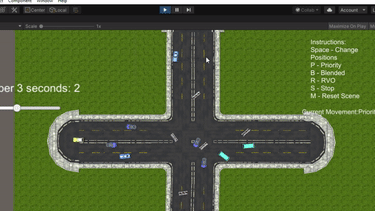
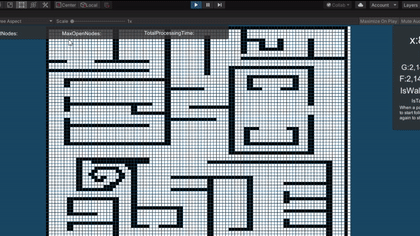
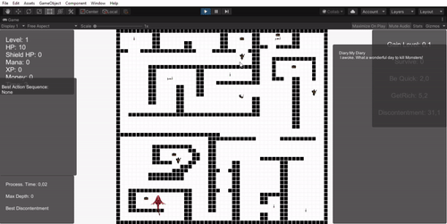

# IAJ-Projects
A compilation of the projects developed for the Ai for Games master's course (source code only). 

Most of the project were implemented by following the awesome book: Artificial Intelligence for Games by Ian Millington and John Fudge.

Movement algorithms:

Pathfinding:

DecisionMaking:

